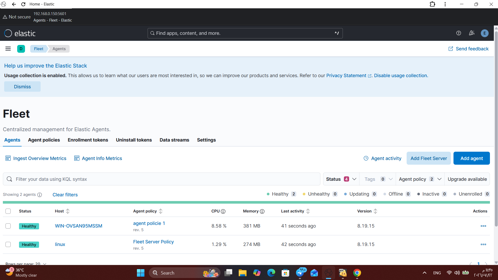
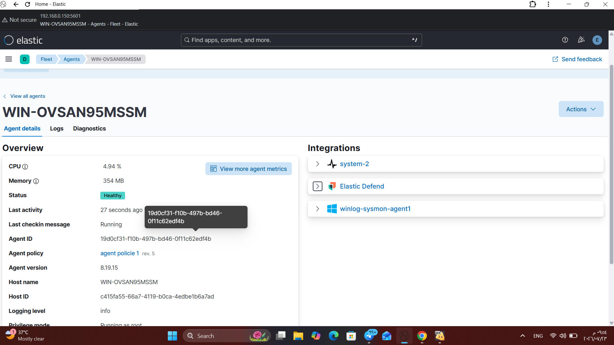
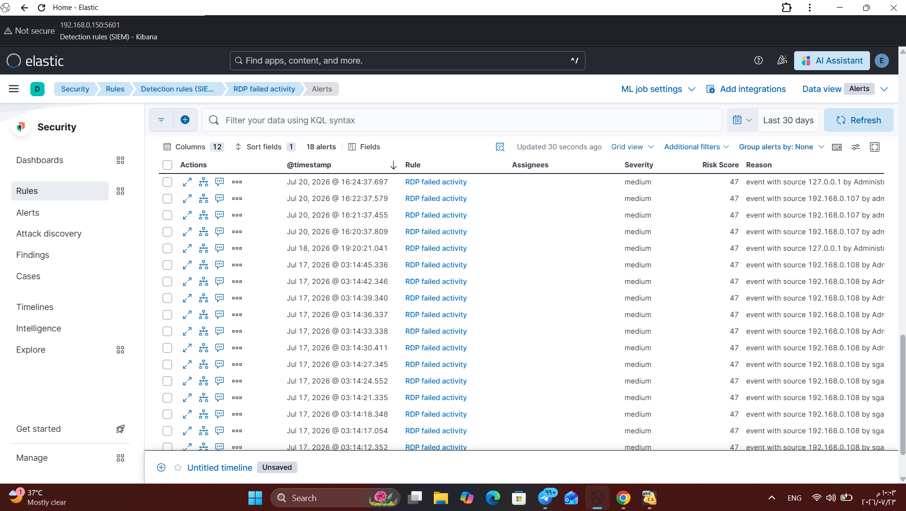
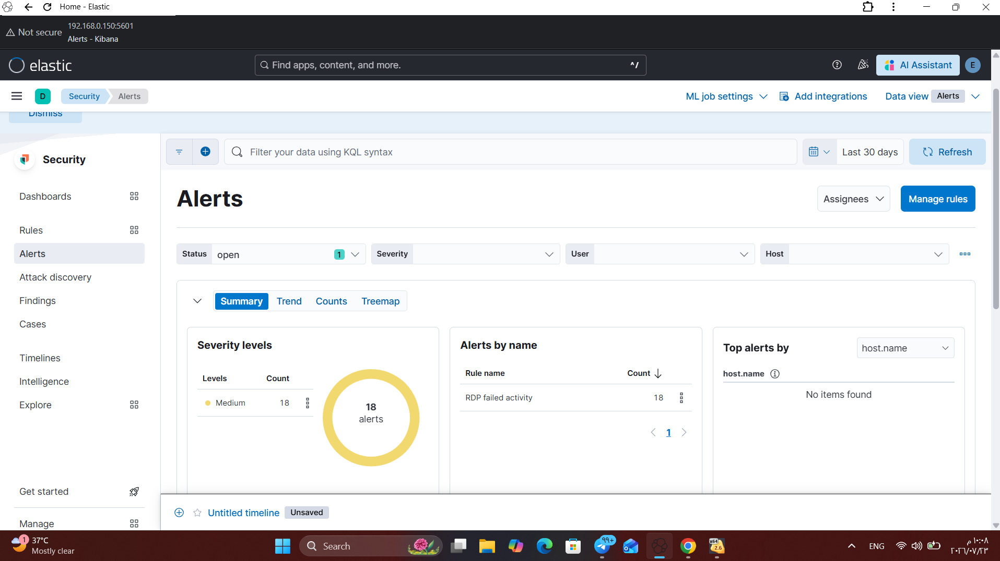
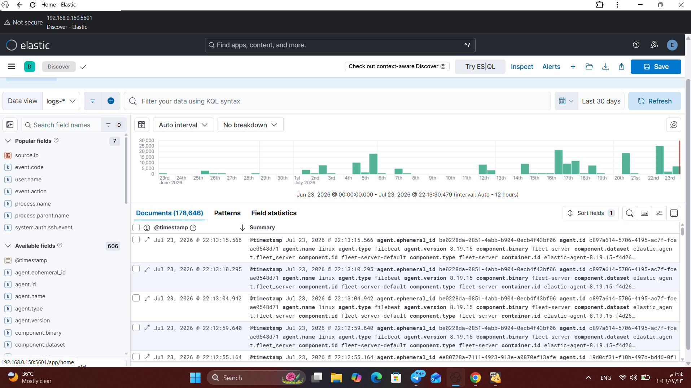

# SOC Home Lab

## Overview
This project demonstrates a complete SOC Home Lab built using the Elastic Stack for threat detection and security monitoring.

## Lab Environment

- Windows 11 (Host)
- Windows Server 2022
- Ubuntu Server
- Elasticsearch
- Kibana
- Fleet Server
- Elastic Agent
- Elastic Defend

---

## Skills Practiced

- SIEM Deployment
- Fleet Management
- Endpoint Security
- Windows Event Log Analysis
- Detection Engineering
- Threat Hunting
- Alert Investigation

---

## Detection Use Cases

- Brute Force Detection (Event ID 4625)
- RDP Failed Login Detection
- PowerShell Attack Detection
- Windows Authentication Monitoring

---

## Screenshots

### Elastic Agent Healthy
The Elastic Agent is successfully connected and reporting to Fleet.

### Elastic Defend Enabled
Elastic Defend integration enabled on the Windows endpoint.

### RDP Detection
Detection of failed Remote Desktop Protocol (RDP) login attempts.

### Brute Force Alert
Brute force attack detected based on multiple failed login attempts.

### Discover
Viewing collected Windows security events in Kibana Discover.

---

## Author

Sajad Mahb
Cyber Security Student
